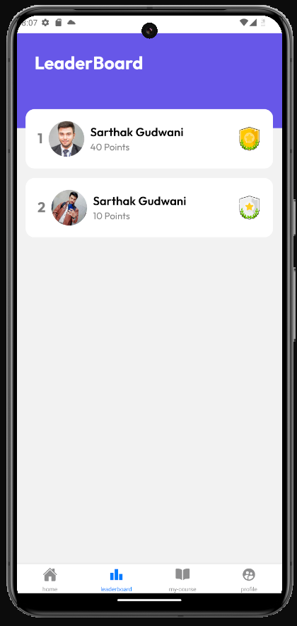

# EduConnect

This React Native application offers an intuitive and seamless platform for learners to access a diverse array of educational resources, encompassing courses, lessons, leaderboard, earn points and more. It harnesses the power of Hygraph, a versatile and scalable headless CMS, for streamlined content management. Additionally, it employs GraphQL for efficient data retrieval and manipulation, ensuring a smooth and responsive user experience.


## Prerequisite

This project requires a specific development environment to function properly. Please ensure you have the following software installed and configured on your system:

  **1. Visual Studio Code:**   
        • Download and install the latest version of Visual Studio Code from the [official website](https://code.visualstudio.com/). 
    
  **2. Node.js:**   
      • Download and install the latest version of Node.js from the [official website](https://nodejs.org/en/).   
      • Verify that **node and npm** commands are accessible in your terminal.

  **3. Java:**   
      • Download and install the latest version of Java from the [official website](https://www.oracle.com/in/java/technologies/downloads/).

  **4. Android Studio and AVD:**   
      • Download and install the latest version of Android Studio from the [official website](https://developer.android.com/studio?gad_source=1&gclid=CjwKCAjwrvyxBhAbEiwAEg_Kgp9iMMDgFIM7jxoegwtlY2FWZoZOiSPgwZCkLGARrwvd7_jPRpvDuBoCUq0QAvD_BwE&gclsrc=aw.ds).

  **5. Git:**   
      • Download and install the latest version of Git from the [official website](https://git-scm.com/downloads).   
      • Ensure you have configured Git with your username and email address using ```git config --global user.name "Your Name"``` and ```git config --global user.email "your_email@example.com"```.
  

## Installation

Before diving into development, ensure you have met the prerequisites outlined in the previous section. Once your development environment is ready, follow these steps to install and configure the project:

1. ### Clone the Git Repository:    

    • Open your terminal or command prompt and navigate to your desired project directory.   
    • Clone the project repository using the command:   

      ``` bash
    git clone "https://github.com/sarthakgudwani2000/EduConnect.git"
      ```

2. ### Install Packages and Dependencies:   

      • Navigate to the cloned project directory:   
      ``` bash
      cd EduConnect
      ```

    • Install the required dependencies using npm:

    ``` bash
      npm install
    ```
    
## Usage

This section outlines the steps for running the project:

1. ### Running the project:    

    • Launch a terminal or command prompt on your system..   
    • Use the **cd command** to change directory to the **EduConnect directory** within your project directory structure.   

      ``` bash
    cd EduConnect
      ```
    • Execute the following command to start the frontend development server:

     ``` bash
     npm start
     ```
     
## Screenshots:   

[]


[]

[]

[]

[]

[]

[]

